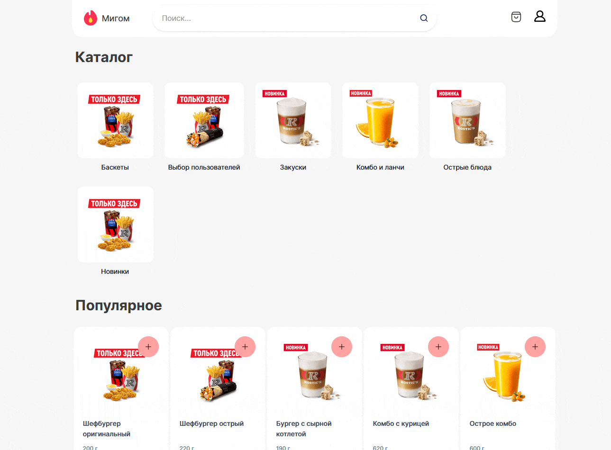
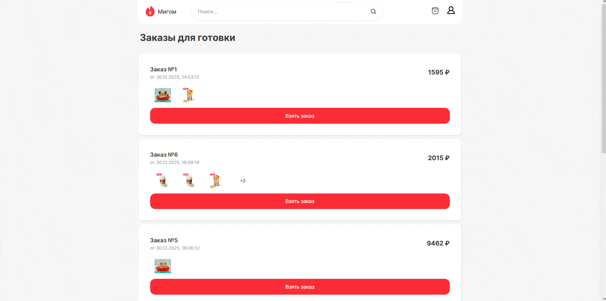
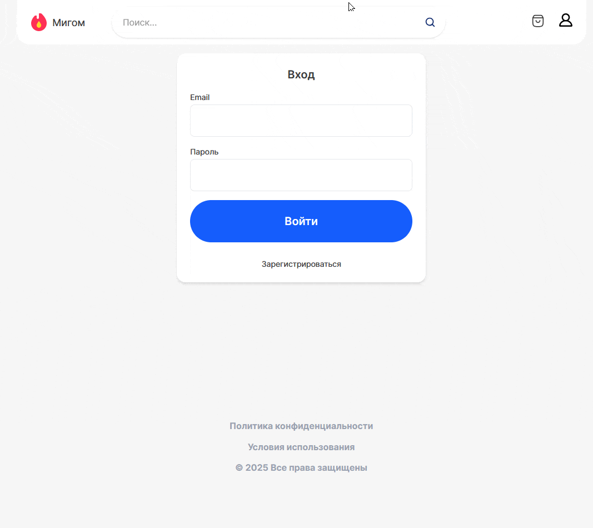
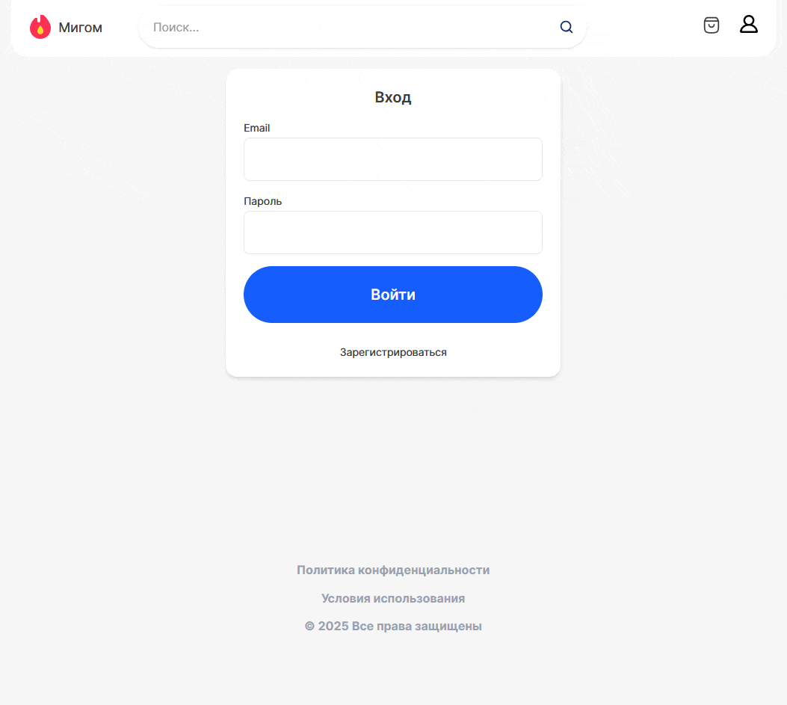
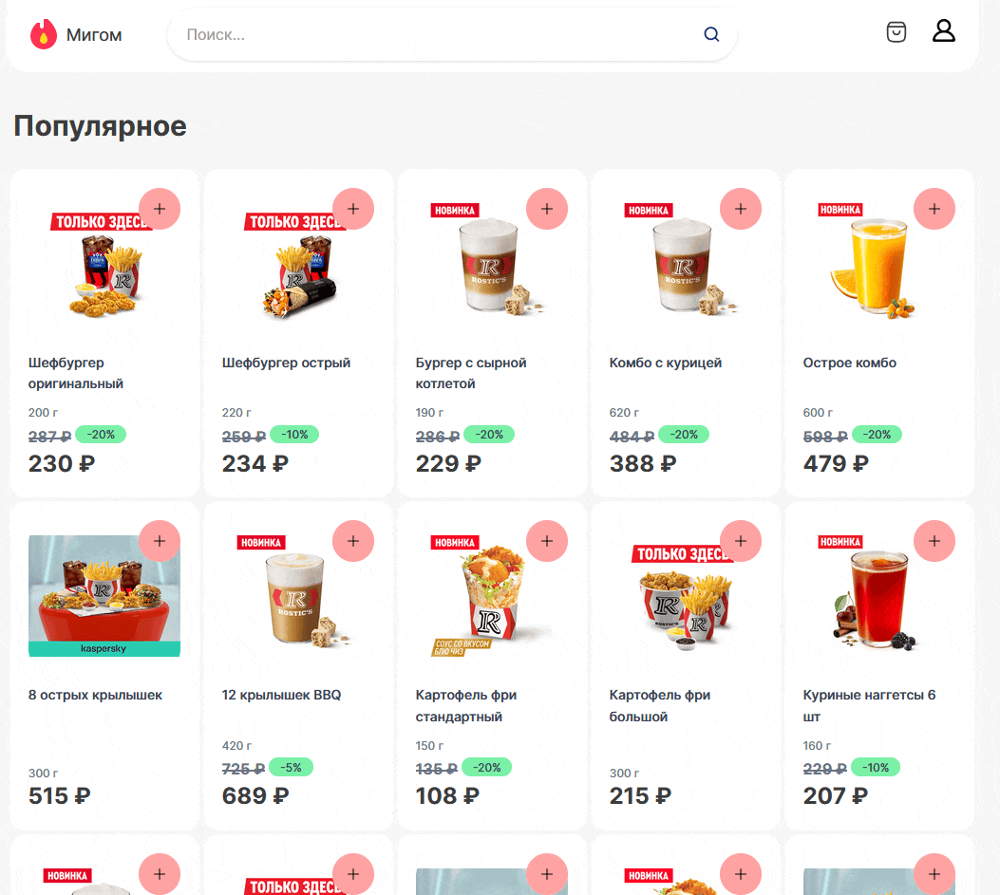
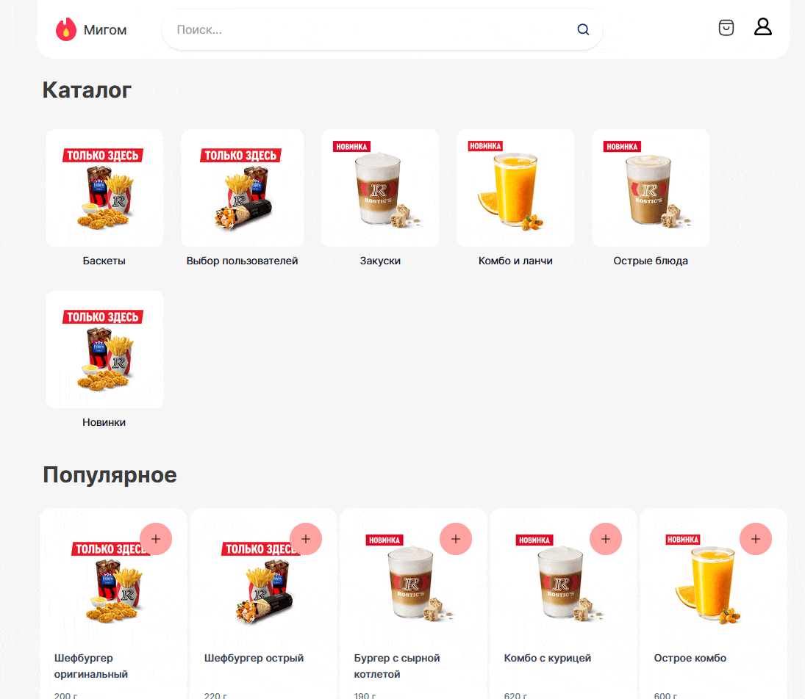
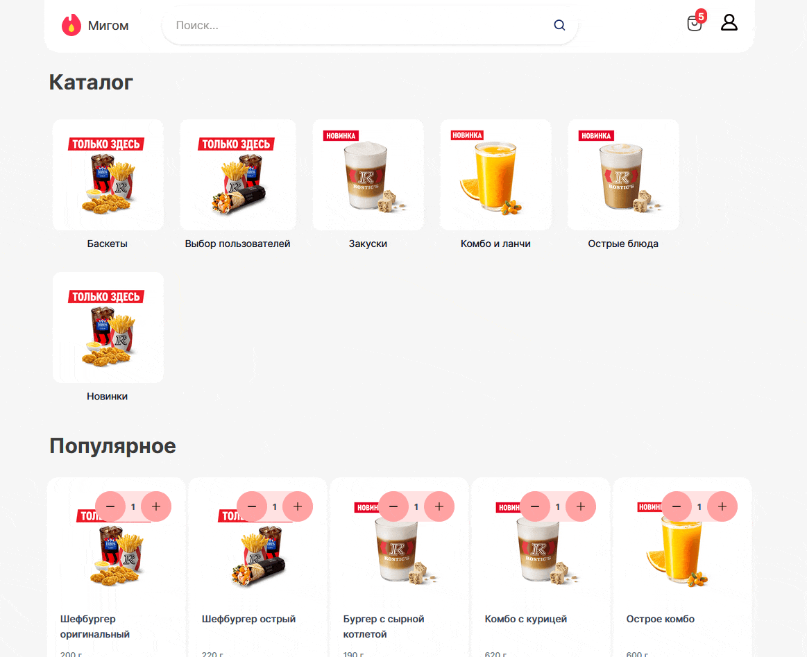

#### Stack: React TypeScript, TailwindCSS v4, Yandex Maps, Vite

## Реализованные Страницы:
- / - Home.tsx (главная страница со всеми продуктами в наличии в ресторане)
  - 
- /category/{id} - Category.tsx (получение продуктов по айди)
  - [Category Page](../media/category.gif)
- /cook - Cook.tsx (работа от повара ресторана, взятие заказа поваром, выставление статуса - 'приготовлен' после передача их курьерам ресторана)
  - 
- /courier - Courier.tsx (работа с заказами на доставку, получение основной информации о заказе и полном адрес доставки, отрисовка яндекс карты с заказом, выставление статуса заказа успешно - доставлен)
  - 
- /login - Login.tsx (авторзиация пользователя через емейл и пароль)
  - 
- /register - Register.tsx (регистрация пользователя через форму ввода имени, фамилии, даты рождения, емейла и пароля)
  - 
- /product/{id} - Product.tsx (вывод товара по ID, вся имеющиеся информация о продукте фото, название, цена, цена со скидкой кол-во грамм, состав продукта, описание, возможность добавление в корзину)
  - 
- /profile - Profile.tsx (вывод информации о пользователе, возможность смены пароля, выход из аккаунта)
  - 
- /orders - Orders.tsx (вывод всех заказов пользователя последних по дате, просмотр статуса заказа)
  - 
- /search - Search.tsx (страница поиска товаров по названию товара, названию категории, любой регистр, по ID категории)
  - 
- /{not_found} - NotFound.tsx (вывод страницы не существует при случайном тексте в адресной строке)
  - 
- /admin - Admin.tsx (управление всеми сущностями, просмотр статистики и дашбордов)
  - 

## Фишки:
- Автоматическая обновление Access Token через Refresh Token (JWT)
- Удобное меню пользователя с кнопками входа, регистрации, профиля, выхода, меню курьера (проверка роли), меню поваров (проверка роли), админ панели (проверка роли), мои заказы
- Адаптация сайта под все устройства Android, IOS, PC, Планшет - динамические отступы, авто-размерность текста на экране
- Корзина товаров с оформление заказа выбором кол-во товаров для заказа, добавления адреса, проверка оплаты
- Access Сontrol - контроль всех ручек для определенных ролей - для админа, курьера, повара, юзер, anonymus user. В случае не соотвествия роли запрещаем доступ
